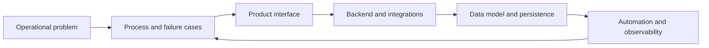

  <h1>Miłosz Kordziński</h1>
  
  

    I build business systems, workflow automation, developer tools and
    data-heavy software — from the interface and backend to the database,
    integrations and deployment.
  

  

    <a href="https://milekv.github.io/">Portfolio</a> ·
    <a href="https://www.linkedin.com/in/milosz-kordzinski-a85947254">LinkedIn</a> ·
    <a href="https://github.com/milekv?tab=repositories">Repositories</a>
  

---

## Featured systems

### [ASK DATABASE](https://github.com/milekv/ask-database) — schema-aware NL-to-SQL

Ask a question about a database and get SQL with the reasoning context kept
visible. The backend retrieves the relevant schema, glossary entries, aliases and
sanitized historical queries; ranks relationship paths; generates structured SQL;
then validates it before returning it.

  
<strong>How it is built</strong>

   
  <ul>
    <li>Schema, Query and Correction Memory stored in PostgreSQL</li>
    <li>Deterministic schema retrieval and relationship-path ranking</li>
    <li>Backend LLM provider boundary with Structured Outputs and Zod</li>
    <li>Safe Mode restricts results to validated <code>SELECT</code>/<code>WITH</code> queries</li>
    <li>Evidence and a decision log are returned with generated SQL</li>
  </ul>

### [SQL Atlas](https://github.com/milekv/sql-atlas) — local-first SQL analysis

Deterministic analysis that runs entirely in the browser. SQL Atlas detects
anti-patterns, explains findings, suggests indexes from query structure, maps
clauses and compares PostgreSQL, MySQL, Oracle, SQLite and SQL Server. Queries are
not uploaded to a server.

  
<strong>What is inside</strong>

   
  <ul>
    <li>Rule-based analyzer with severity, scoring and passed checks</li>
    <li>Index suggestions based on filters, joins, grouping and ordering</li>
    <li>Before/after rewrites, query map and Markdown report export</li>
    <li>Roadmap: EXPLAIN JSON, CLI and GitHub Action checks</li>
  </ul>

### [VisualDB Studio](https://github.com/milekv/visualdb-studio) — visual schema design

An interactive PostgreSQL schema modeller. Tables and relationships are edited on
a visual canvas; the resulting model can be validated, scored and exported as SQL
without hiding the underlying database design.

  
<strong>Capabilities</strong>

   
  <ul>
    <li>Table, column, key, constraint and relationship editing</li>
    <li>PostgreSQL DDL generation, including indexes and foreign keys</li>
    <li>Schema validation, quality scoring and index recommendations</li>
    <li>Templates and suggestions for extending an existing model</li>
  </ul>

### [OraBank](https://github.com/milekv/oracle-bank-system) — Oracle banking architecture

A realistic Oracle database architecture split into core, transaction,
administration and reporting domains. It models customers, accounts, cards,
transfers, loans and audit data rather than stopping at a small demo schema.

  
<strong>Database engineering scope</strong>

   
  <ul>
    <li>SQL and PL/SQL packages for accounts, balances and transfers</li>
    <li>Indexing, query analysis and range partitioning</li>
    <li>Roles, privileges, reporting views and audit access</li>
    <li>Scheduler jobs plus backup and recovery scenarios</li>
  </ul>

## How I approach a system

| Area | Typical work | Main tools |
| --- | --- | --- |
| Business systems | Internal tools, SaaS workflows, process automation | TypeScript, React, Node.js, Supabase |
| Data systems | Data modelling, migrations, retrieval, performance | PostgreSQL, Oracle, SQL |
| Developer tools | Local-first analysis, generators, CI checks | TypeScript, Vite, GitHub Actions |
| Integrations | APIs, webhooks, data exchange and scheduled work | Fastify, REST, Docker, cloud services |

## Currently building

> **RehabOS** — an operating system for physiotherapy practices and clinics,
> connecting clinic operations, therapists and patients across the therapy
> process.

I am also extending the SQL tooling direction toward EXPLAIN-plan analysis, CLI
workflows and repository-level checks, while continuing to build automation around
real operational handoffs.

## Open source

  
<strong>Recent merged pull requests</strong>

   
  <ul>
    <li><a href="https://github.com/tungbq/devops-project/pull/128">tungbq/devops-project #128</a> — corrected a Terraform VPN access guideline</li>
    <li><a href="https://github.com/vitorfranklin/retrohost/pull/26">vitorfranklin/retrohost #26</a> — resolved Markdown lint issues</li>
    <li><a href="https://github.com/thomaspinder/GPJax/pull/685">thomaspinder/GPJax #685</a> — corrected GraphKernel spectral documentation</li>
    <li><a href="https://github.com/rodrigo-arenas/Sklearn-genetic-opt/pull/304">Sklearn-genetic-opt #304</a> — updated community documentation references</li>
  </ul>

---

  <strong>Build the whole system. Keep the moving parts visible.</strong>
    
  <a href="https://github.com/milekv">GitHub</a> ·
  <a href="https://www.linkedin.com/in/milosz-kordzinski-a85947254">LinkedIn</a> ·
  <a href="https://milekv.github.io/">Portfolio</a>

